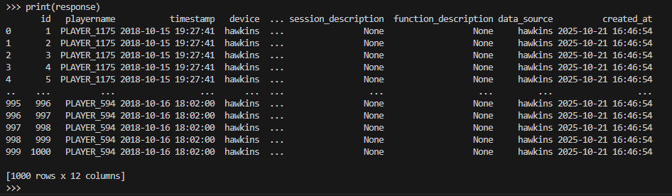

## Database Connection and Data Exploration

This document outlines the steps I followed to set up my Python environment, connect to the MySQL database, and explore the `research_experiment_refactor_test` table.

---

## Steps

- Set up a Python environment and installed the required libraries: `sqlalchemy`, `pandas`, `pymysql`, and `python-dotenv`
- Created a `.env` file to securely store database credentials
- Established a connection to the MySQL database using SQLAlchemy
- Verified the connection by querying the `research_experiment_refactor_test` table
- Loaded the results into a pandas DataFrame and printed the output
- Captured a screenshot of the query results (see below)

---

## Environment Setup

1. **Installed required libraries:**

   ```bash
   pip install sqlalchemy pandas pymysql python-dotenv
   ```

2. **Created a `.env` file** with the following variables:
        POWERUSER=your_username_here
        PASSWORD=your_password_here
        HOSTNAME=your_host_here
        DATABASE=your_database_name_here

---

## Connection and Query Code

```python
from sqlalchemy import create_engine
import pandas as pd
import os
from dotenv import load_dotenv

load_dotenv()

# Load credentials from environment variables
sql_username = os.getenv('POWERUSER')  # renamed USERNAME to avoid Windows reserved word
sql_password = os.getenv('PASSWORD')
sql_host = os.getenv('HOSTNAME')
sql_database = os.getenv('DATABASE')

# Create connection URL
url_string = f"mysql+pymysql://{sql_username}:{sql_password}@{sql_host}:3306/{sql_database}"
conn = create_engine(url_string)

# Sample query to test connection
sql_toexecute = """
  SELECT *
  FROM research_experiment_refactor_test
  LIMIT 1000;
"""

# Execute query and load results into a DataFrame
response = pd.read_sql(sql_toexecute, conn)
print(response)
```
---

## Screenshot of Query Results



---

## Notes

- I made sure to exclude the `.env` file from version control by adding it to `.gitignore`
- The `USERNAME` variable was renamed to avoid conflicts with Windows reserved keywords
- The query was limited to 1000 rows for initial exploration

---

